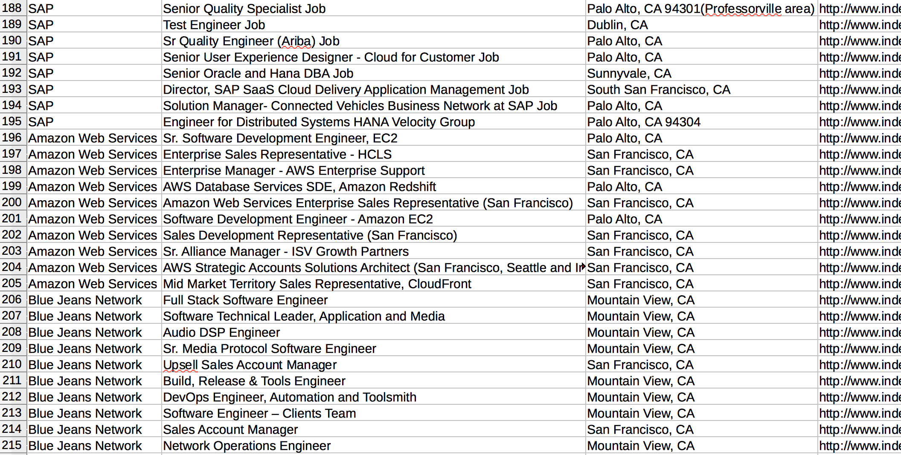

# jobhuntpy

jobhuntpy grab all the open jobs from indeed.com based on the keyword, location your desire, and your linkedin connections.

Often times, you wonder how you can leverage your networking to land on a job you are interested in. So you go to linkedin, 
browse through your friend's companies that you are interested in, and come back to query in indeed.com to see if these 
companies some ideal job openings for you.

Going back and forth between indeed.com and linkedin can take up a lot of time. Their web UIs are just not designed for it.
You might end up spending 80% of the time and effort to compile the data into a spreadsheet before you can even analyze
the the companies, job titles, when they first appeared... etc.

jobhuntpy takes care all of these for you. As you will see in the followup sessions, as soon as you provide your linkedin
login credential and other credentials like job keyword, city, and state, it is able to provide you with 2 csv files,
connections.csv and jobs.csv.

connections.csv presents all your linkedin connections, including location, job function and their company information 
in a single sheet, so that you will be able to see who you should go talk to about your job applications.
 
jobs.csv in turn lists all the available jobs on indeed.com in your linkedin friends' companies, filtered by the
location and keyword information you provide. This way, you are able to pinpoint the job opportunities your
friends are able to help you.

The best part of spreadsheets like csv files is that you are now able to filter, sort, and join all the data with your
excellent excel skills.

Happy job hunting.

## Installation

**jobhuntpy can only be installed through pip for now.**

Download and unzip the source file into a folder on your computer directly from GitHub:
https://github.com/wingchen/jobhuntpy/archive/master.zip

cd into your root jobhuntpy folder, and pip install the folder:

```
cd /path/to/my/jobhuntpy/folder/jobhuntpy/
pip install .
```

Voila, you have jobhuntpy installed on your machine.

## workflow

**At the moment, jobhuntpy can only be accessed through command line interface. GUI version will follow soon.**

### Run the command

Run jobhuntpy command with all the arguments of linkedin email, keyword, city, and state like this:

```
jobhuntpy [email] [keyword] [city] [state]

# exp:
jobhuntpy darwing.chen@gmail.com software\ engineering San\ Francisco CA
```

You can do `jobhuntpy -h` for the help information.

**Please add `\` in front of any space character in a single argument, for example `-k software\ engineering`.**

You should see the program is asking for your linkedin password to continue, just type the password and hit enter.

```
2015-06-25 21:55:41,992 - jobhuntpy - INFO - Argument parsing successful.
Please type in your linkedin password.
Password: 
```

You will then see jobhuntpy goes out and grabs all the data for you.

```
2015-06-25 21:57:11,156 - jobhuntpy - INFO - Found 21 related jobs at Uber in San Francisco
2015-06-25 21:57:12,403 - jobhuntpy - INFO - Found 561 related jobs at Apple in San Francisco
2015-06-25 21:57:13,628 - jobhuntpy - INFO - Found 3 related jobs at 3D Robotics in San Francisco
2015-06-25 21:57:14,161 - jobhuntpy - INFO - Found 1 related jobs at Grand Rounds, Inc. in San Francisco
2015-06-25 21:57:14,439 - jobhuntpy - INFO - Found 0 related jobs at PayScale, Inc. in San Francisco
2015-06-25 21:57:15,459 - jobhuntpy - INFO - Found 39 related jobs at Dell in San Francisco
2015-06-25 21:57:16,693 - jobhuntpy - INFO - Found 0 related jobs at Adviso in San Francisco
2015-06-25 21:57:18,491 - jobhuntpy - INFO - Found 48 related jobs at Verizon in San Francisco
```

You then will see connections.csv and jobs.csv in the same folde you are in.

Here is a screenshot from jobs.csv as an example.



## Open source and contribute

jobhuntpy is an open-sourced project. The project is hosted in GitHub: https://github.com/wingchen/jobhuntpy

Patches and feature contributions are welcome. Please send the pull requests to me.

## Why not a web service?

I hate giving data to clouds, so nor do I have any interest in storing your data. I only do it in projects which provide
more value if I do so. And this ain't one.

This software only automates logging into linkedin, pulling your connection data, and querying on indeed.com for job
opening you might be interested in for you. You are the person who is conduction the activities and the only one who
has the data back.

## TODO

1. handle thread failure
2. build up mac/windows GUI
3. test cases

## Bugs and requests

Please file a bug or request to me through the github UI: https://github.com/wingchen/jobhuntpy/issues/new